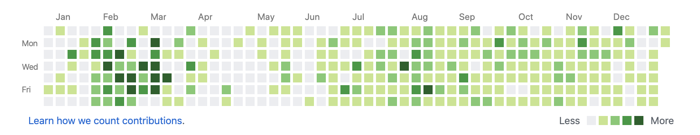

# contributions-cloner



[GitHub Contributions](https://bit.ly/2CJpXNW). They're an eccentric thing to
care about – but for many engineers they're a great visual overview of a life's
work. It's worth dedicating a few minutes to ensuring that your contributions
are backed up.

Contributions might be missing for several reasons:
- You've been working on a project outside of GitHub, hosted in-house or
  elsewhere.
- You've left a GitHub Organization and didn't know about the
  [counterintuitive and delicate dance](https://bit.ly/34X2R2t) needed to keep
  your contributions.
    - TL;DR: make sure you star any private repos in a GitHub Organization
      before leaving and don't delete your oldverified company email from your
      GitHub profile.

## How this script works

GitHub contributions are only interested in the total number of commits per
day. The number of lines and any other factors are irrelevant.

To back up your contributions, we therefore need only find all contributions
you made in any private repositories and make a dummy backdated commit in
a new repository. You can then push this backup respository to your GitHub
profile and set it's visibility to private.


### Usage

```
Usage: ./contributions-cloner.sh [-h|--help] -a email1 [-a email2, -a ...]
       [-d destination] repo1 [repo2, ...]

contributions-cloner clones commit timestamps in order to preserve your GitHub
contribution graph when leaving a GitHub organization that a repository belongs
to. No source code or otherwise identifying information is cloned other than
'<your email> comitted on <timestamp>'. This is all the information that the
GitHub contributions graph requires.

contributions-cloner works by scanning a list of repositoreis for any commits
authored by your email and creating a dummy placeholder file in a backup
repository in it's place with the same timestamp as the original commit. No
information will be copied from the source repositories other the date of the
commit.

    Options:
        --help | -h
            Prints this menu
        -a email
            A list of author emails which, if responsible for a commit in any
            of the listed repositories, will result in a dummy commit being
            created.
        -d destination
            The repository into which the dummy commits will be made. If not
            specified, this will default to './contributions'.

    Arguments:
        repo
            A list of local git repositories which will be scanned for commits
            made by the specified author emails.
```

## Known Issues

### Pull Requests and Issues

This script currently ignores pull requests and issues which also count
towards your GitHub contributions.
